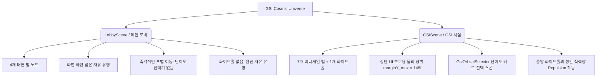

# 🌌 GSI Cosmic Physics & Visual Design Standards (우주 물리 및 비주얼 동기화 표준 규격)

본 문서는 **GSI 메인 로비 화면(`LobbyScene`)**과 **GSI 시설 로비 화면(`GSIScene`)** 간의 물리 법칙, 시각적 일체성 및 햅틱 오디오 연동을 동일하게 유지하기 위한 개발 및 설계 동기화 표준 가이드입니다. 

향후 코드를 수정하거나 새로운 기능을 추가할 때(인간 개발자 및 AI 에이전트 공통) 본 규격을 철저히 준수하여 씬 간 조작감의 괴리가 발생하지 않도록 해야 합니다.

---

## 💎 1. 필수 동기화 표준 (Must Be Identical)

### A. 우주 물리 공식 및 상수 (Kinematics & Constants)
두 씬에 상주하는 모든 별 노드(`GsiLobbyStarNodeController`, `GsiGsiStarNodeController`)는 공용 추상 기반 클래스 `StarNodeControllerBase`를 상속받아 동일한 우주 마찰력 및 물리 관성 계수를 **코드 레벨에서 자동 공유**합니다. 물리 계수를 변경할 때는 `StarNodeControllerBase`만 수정하면 양 씬에 즉시 반영됩니다.
- **마찰력 저항 (`Friction`)**: `0.45f` (지수적 감속 적용: `Mathf.Exp(-Friction * Time.unscaledDeltaTime)`)
- **최대 속도 제한 (`MaxVelocity`)**: `1800f`
- **최저 자율 유영 속도 (`MinDriftSpeed`)**: `80f` (감속하다가 이 속도에 도달하면 마찰력을 무시하고 무한 유영)
- **정지 데드존 법칙 (Stationary Drag Snapping)**: 
  드래그 중 마우스를 멈추고 뗄 때 잔여 델타 벡터 노이즈로 인해 튕겨 나가는 현상을 차단하기 위해, 드래그 속도를 프레임 포지션 델타(`Time.unscaledDeltaTime` 보정) 기반으로 측정하여 `Time.unscaledDeltaTime` 이 정지 상태에 가까우면 속도를 즉시 `(0,0)`으로 스냅하고 `IsStaticStop = true` 고정 상태로 변환합니다.

### B. 탄성 충돌 및 햅틱 효과음 (Elastic Collisions & Cooldown)
- **충돌 반경 (`CollisionRadius`)**: **`30f` (직경 `60f`)**
  별 노드들의 중심 화이트 코어 주변 오라가 스치며 겹쳐지는 최적의 시각 지점에서 구체 탄성 충돌이 일어나도록 축소 통일합니다.
- **상대 속도 비례 오디오 믹싱**:
  충돌 시의 상대 속도(`relativeSpeed = Mathf.Abs(velAlongNormal)`)를 측정하여, 볼륨 크기(`Clamp 0.15f ~ 0.75f`)를 비례 조절하고, 강하게 충돌할 때는 `PrimaryClick` SFX를, 은은하게 비빌 때는 `Hover` SFX를 매칭 재생합니다.
- **오디오 중복 스패밍 차단 (Cooldown)**:
  별들이 밀착하여 밀어낼 때 소리가 극단적으로 겹쳐 재생되는 피크 노이즈를 막기 위해, 별 노드마다 최소 **`0.15초` 사운드 쿨다운** 타이머를 동일하게 작동시킵니다.

### C. 심연의 무광 우주 배경 (Cosmic Depth Backdrop)
- 4개의 메인 포털과 7개의 미니게임 별들의 네온 광채 비주얼 대비(Contrast)를 배가시키기 위해 배경의 명도를 고도로 톤다운합니다.
- **기초 그라데이션 컬러**: `spaceDark = new Color(0.002f, 0.001f, 0.004f)` / `indigoBlack = new Color(0.001f, 0.002f, 0.006f)`
- Perlin 노이즈 기반 성운 구름의 세기는 극히 은은하게 낮추어 자극적이지 않게 유지합니다.

---

## 🪐 2. 의도적 차별성 제안 (Intentional Differences & Proposals)

다음 항목들은 두 씬의 역할과 사용자 조작 편의성 극대화를 위해 **의도적으로 분리하여 작동**하게 구현되었으며, 일치시키지 않는 것이 권장됩니다.

### 1) 중앙 통합 시험 화이트홀의 성간 척력장 (Repulsion Field)
- **로비화면**: 중앙 포커스 천체가 없으므로 4개의 별들이 화면 전체를 활공합니다.
- **GSI 시설**: 공식 시험을 상징하는 **통합 시험 화이트홀 노드**가 `(0,0)` 중심에 PULSING 상태로 고정 상주합니다. 화이트홀은 7개의 미니게임 별들이 중심부로 빨려 들어와 뒤엉키는 것을 막기 위해 **반경 `240f` 픽셀의 부드러운 척력장**을 발산해 별들을 외곽 궤도로 밀어냅니다.
- *이유*: GSI 씬은 Orrery 성계의 시각 테마를 극대화해야 하며, 별들이 중앙의 거대한 천체와 적절한 거리를 유지하도록 물리력을 조율하는 것이 기하학적 균형과 햅틱 손맛을 증대시킵니다.

### 2) 동적 난이도 궤도 선택기 (GsiOrbitalSelector) 연동 여부
- **로비화면**: 로비의 4개 별(Start, Shop, Inventory, Altar)은 클릭 시 난이도 설정 없이 즉각 해당 포털 씬으로 이동합니다.
- **GSI 시설**: 7개의 미니게임 별과 1개의 화이트홀 노드는 클릭 시 즉각 이동하지 않고, 천체를 중심으로 **9개의 난이도 구체가 탄성 있게 회전하며 확장 전개**되는 궤도 선택기를 띄웁니다.
- *이유*: 메인 로비의 포털은 중간 팝업 없이 즉각 씬이동이 이루어지는 것이 이동 편의성상 최적이며, GSI 시설은 '연습 등급제 훈련'과 '공식 통합 시험' 구역이므로 등급 선택 연출을 성계의 공전 기믹(Orbital Arc)으로 시각적 쾌감을 제공하는 것이 기획 의도에 완벽하게 부합합니다.

### 3) 상단 UI 클릭 오작동 방지 안전지대 (Physics Screen Boundaries)
- **로비화면**: 상단 경제바 영역이 비교적 좁고 심플하여 화면 상단 한계선 여백이 넓습니다.
- **GSI 시설**: 상단에 뒤로가기 버튼, Stardust 재화 및 Exam Ticket 카운터 등 세밀하게 눌려야 할 메인 UI 스트립이 꽉 들어차 있습니다. 별들이 유영하다가 뒤로가기 버튼이나 재화 영역을 가리지 않도록 **상단 바운더리 여백 한계선(`marginY_max = 148f`)**을 메인 로비(`64f`)보다 두 배 이상 엄격하게 잠금 장벽을 쳤습니다.
- *이유*: 7개의 별 노드가 마구 활공하다가 상단의 중요한 조작 단추들을 덮음으로써 발생하는 터치 오동작(Misclick Interference)을 미연에 완벽하게 방지하기 위함입니다.

### 4) 별 노드의 비주얼 레이어 및 크기 (Visual Scale & Structural Layers)
- **로비화면**: 별 노드가 **5개 레이어**(OuterGlow, InnerRingGlow, SpikeV, SpikeH, CoreDiamond)로 더 정밀하게 구성되며, 호버 시 **`1.4배`** 확대 및 클릭 시 **`0.85배`**로 스쿼시됩니다. 툴팁 폰트 크기는 `20f`, 오프셋은 `-46f` 흰색입니다.
- **GSI 시설**: 별 노드가 **4개 레이어**(OuterGlow, SpikeV, SpikeH, CoreDiamond - InnerRingGlow 제외)로 깔끔하게 구성되며, 호버 시 **`1.35배`** 확대 및 클릭 시 **`0.8배`**로 스쿼시됩니다. 툴팁 폰트 크기는 `18f`, 오프셋은 `-42f`에 각 별의 테마 색상을 따릅니다.
- *이유*: 메인 로비는 별이 4개뿐이므로 빈 화면에서 극상의 영롱함과 프리미엄 존재감을 뽐내기 위해 레이어를 추가하고 크기를 키웠습니다. 반면 GSI 시설은 7개의 연습 별과 1개의 거대한 화이트홀까지 총 8개의 은하적 개체가 한 화면에 조밀하게 공존하므로, 과도한 시각적 복잡도(Visual Clutter)와 겹침 현상을 방지하고 조작 가독성을 극대화하기 위해 레이어 수를 4개로 간소화하고 크기를 미세하게(약 12% 내외) 축소 연출하였습니다.

