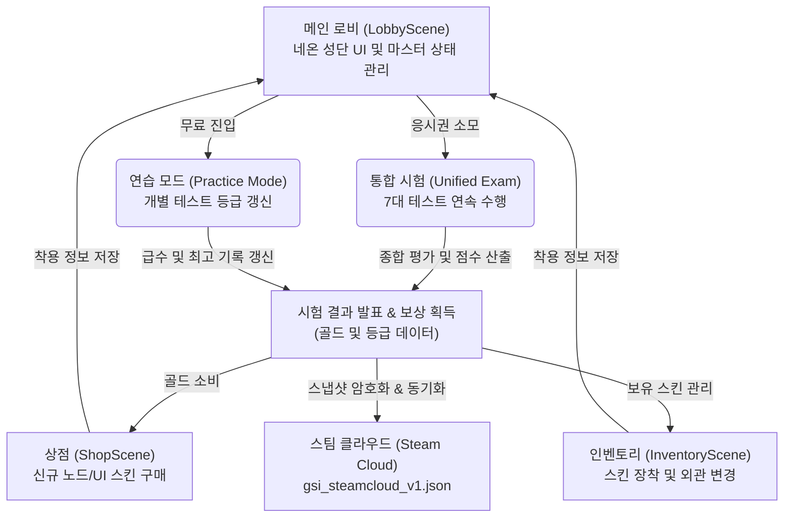

# ⚜️ The Axiom (G.S.I) — 게임 기획 정리서 (Game Design Specification)

이 문서는 RunicAtelier가 개발하는 standalone 2.5D 캐주얼 피지컬 & 인지 능력 테스트 시뮬레이터 **「The Axiom (G.S.I)」**의 핵심 메커니즘, 시스템 순환 구조, 그리고 **A안(콘텐츠 고도화)**의 설계 구체화안을 정리한 마스터 사양서입니다.

---

## 🏛️ 1. 게임 개요 (Game Overview)

*   **타이틀**: The Axiom (프로젝트명: G.S.I — Grand Sage Initiative)
*   **플랫폼**: PC (Steam Standalone 독점 지원)
*   **장르**: 2.5D 피지컬 & 인지 능력 측정 시뮬레이터 (Physical & Cognitive Diagnostic System)
*   **핵심 가치**: 
    1.  **아키텍처의 순수성**: 임시변통(Hardcoding) 없는 완벽한 이벤트 기반 모듈화로 지속 확장 가능한 미니게임 생태계 구축.
    2.  **미학적 조형미 (Aesthetics)**: HSL 조율 네온 컬러 팔레트, 매끄러운 트랜지션, 120 FPS 타겟의 초정밀 인터랙션 연출.
    3.  **공정함과 비동기성**: 시드(Seed) 공유 및 무결성 검증을 통한 부정행위 방지형 1:1 비동기 랭킹 경쟁.

---

## 🔁 2. 핵심 순환 루프 (Core Game Loop)

---

## 🎮 3. 7대 인지-피지컬 테스트 상세 (The 7 Pillars)

각 테스트는 독립된 컨트롤러(`*TestController.cs`)와 난이도 명세(`*Difficulty.cs`)를 지니며, `GSISceneBootstrap`에 의해 씬 진입 시 동적으로 초기화됩니다.

| 테스트 유형 | 컨트롤러 클래스 | 핵심 메커니즘 | 난이도 영향 변수 | 미학 및 연출 요소 |
| :--- | :--- | :--- | :--- | :--- |
| **1. 조준력 (`Aim`)** | `AimTestController` | 무작위 생성 노드 신속 정밀 조준 & 클릭 | 타겟 크기, 생존 시간, 노드 생성 밀도 | 크기가 줄어들며 점멸하는 HSL 디케이 링 |
| **2. 탄막 회피 (`BulletHell`)** | `BulletHellTestController` | 중앙 포인터를 조작하여 수학적 궤적 탄막 회피 | 탄속, 탄막 크기, 발사 주기, 회전 각가속도 | 기하학적 나선 파형 및 은은한 궤적 이펙트 |
| **3. 클릭속도 (`Cps`)** | `CpsTestController` | 초당 클릭 수(Clicks Per Second) 극한 도달 | 지속 시간 제한, 최소 타격 주기 임계값 | 타격 시 뿜어 나오는 미세 네온 스파크 |
| **4. 기억력 (`Memory`)** | `MemoryTestController` | 3D 격자의 점멸 패턴을 시퀀스대로 추적/복기 | 격자 크기(3x3 -> 5x5), 암기 시간, 시퀀스 길이 | 매끄러운 3D 노드 플립 애니메이션 |
| **5. 다중 추적 (`Mot`)** | `MotTestController` | 이동하는 다수의 객체 중 지정된 Target 추적 | 타겟 개수, 장애물 밀도, 무작위 바운싱 속도 | 물리 잔상(Ghost Trail) 및 은은한 반투명 쉴드 |
| **6. 반응속도 (`Reaction`)** | `ReactionTestController` | 무작위 시각/청각 신호 직후의 클릭 딜레이 측정 | 트리거 대기 무작위 시간(ms), 페이크 자극 빈도 | 급격한 전체 색상 스크린 플래시 및 펄스 이펙트 |
| **7. 리듬 감각 (`Rhythm`)** | `RhythmTestController` | 비트에 맞춰 생성 라인을 타격하는 판정(Sync) | 노트 낙하 속도, 비트 밀도(BPM), 판정 윈도우 크기 | 완벽 판정 시의 텍스트 스케일업 & 네온 잔상 |

---

## 💎 4. 경제 및 성장 모델 (Progression & Economy)

### A. 이중 재화 순환
*   **응시권 (Admission Ticket)**: 
    *   통합 시험(`Unified Exam`)에 진입하기 위한 유료 입장권입니다. 
    *   일정 시간마다 자동으로 충전되며, 연습 모드 특정 등급 달성 또는 골드를 통해 소환(구매)할 수 있습니다.
*   **골드 (Gold)**:
    *   각 테스트의 최종 점수 및 등급에 비례하여 획득하는 인게임 기본 재화입니다.
    *   상점(`ShopScene`)에서 스킨을 해금하는 단일 통로로 작용합니다.

### B. 등급 및 숙련도 체계
*   **연습 급수 (Practice Grades)**: 
    *   초보(9급)부터 초고수(1급 및 'Axiom' 단)까지 설계되어 있습니다.
    *   일정 점수 임계값을 넘을 때마다 등급 갱신 이벤트가 트리거되며, 로비 성단 UI의 노드 광채가 더욱 강해집니다.
*   **스킨 장착 (Cosmetics)**:
    *   단순 장식을 넘어, 플레이어가 선호하는 색조(HSL 네온 테마)와 테스트 노드의 스킨을 커스터마이징하여 몰입감을 증폭시킵니다.

---

## 🔒 5. 비동기 1:1 대전 및 보안 아키텍처

실시간 매칭 서버 구축 부담을 제거하면서도 극상의 경쟁적 재미를 주기 위한 하이브리드 비동기 대전 모델입니다.

1.  **시드 기반 동일 시험 (Deterministic Sandbox)**:
    *   비동기 매칭 시 생성되는 `AsyncMatchId`와 고정된 **의사난수 생성 시드(PRNG Seed)**를 기반으로 양 플레이어에게 완전히 동일한 궤적과 노드 배치 생성.
2.  **데이터 무결성 검증 (Payload Integrity)**:
    *   `VersusAsyncScorePayload`를 통해 계정 식별자(`SubmitterSteamId`), 시드 정보, 판정별 타임스탬프 시퀀스 해시를 기록하여 클라이언트 변조 및 메모리 에디팅 검증.
3.  **스팀 클라우드 SSOT**:
    *   모든 재화 및 기록은 부팅 시 로컬과 스팀 원격 저장소(`gsi_steamcloud_v1.json`) 간 상호 대조 후 최신 타임스탬프로 수렴(SSOT).

---

## ⚡ 6. A안(콘텐츠 고도화) 기획 상세 및 액션 플랜

주인님께서 A안 진행을 결정하셨으므로, 아래 3대 축을 기준으로 점진적 구현에 착수합니다.

### 🎯 [A-1] 테스트별 깊이 강화 (난이도 설계의 수치화)
*   **현재 문제점**: 기존 난이도가 단순히 쉬움/보통/어려움의 투박한 변수 조절에 그침.
*   **개선안**:
    - `*Difficulty.cs`에 각 미니게임 고유의 점진적 스케일러(Fitted Curves) 알고리즘 도입.
    - 예를 들어, `BulletHellDifficulty`에서 시간 경과에 따라 탄속이 로그 그래프 형태로 부드럽게 증가하고, 플레이어의 누적 회피 점수에 맞춰 난이도 웨이브가 실시간 가속되는 구조 설계.

### 📐 [A-2] 리듬 및 탄막 테스트 패턴 확장
*   **현재 문제점**: 단조로운 선형 탄막 및 단순 4박자 비트 낙하 노트.
*   **개선안**:
    - `BulletHellTestController`에 기하학적 나선형(Spiral), 백터 회전형(Cross-Vortex), 조준 저격형(Sniper) 탄막 스포너 패턴을 수학적 수식(삼각함수, Polar Coordinates)으로 모듈화 탑재.
    - `RhythmTestController`에 수동 작곡 패턴 시퀀싱을 지원하는 JSON 또는 스크립터블 오브젝트(ScriptableObject) 비트 노드 맵 로더 구축.

### 🎨 [A-3] 시각적/청각적 미학 완성 (Aesthetics)
*   **현재 문제점**: UI 요소와 게임 이펙트의 톤이 일관되지 못하거나 강한 네온 대비가 부족함.
*   **개선안**:
    - HSL 컬러 스펙트럼 관리 컴포넌트(`GsiColorThemeManager`)를 설계하여 UI 배경과 노드 컬러가 하나의 테마(예: Deep Obsidian base + Cyberpunk Cyan/Neon Magenta accent)로 유기적으로 흐르게 제어.
    - 모든 타겟 적중 및 판정 순간에 유려한 파티클 버스트와 동적 스케일 스윙 마이크로 애니메이션 삽입.
